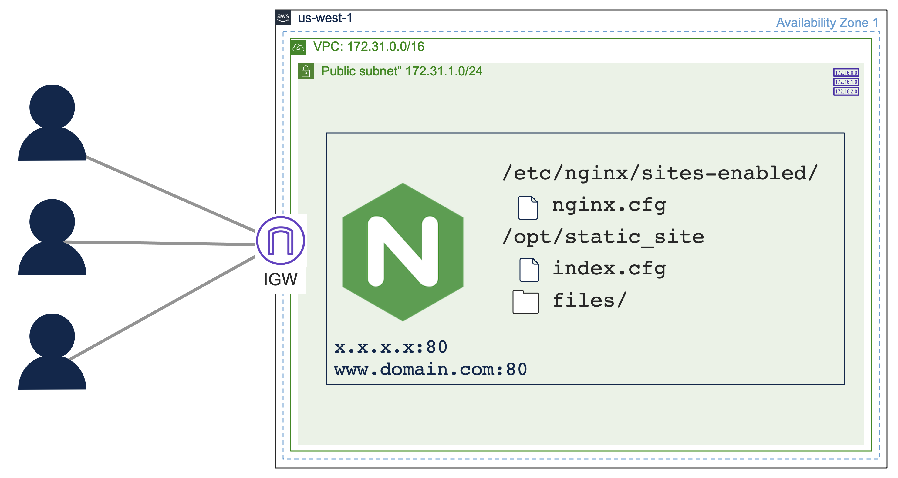

# Deploy an NGINX Web Server on Ubuntu in AWS using Ansible

Deploys an NGINX web server instance on Ubuntu in AWS using Ansible.  You may deploy this using resources in the [AWS Free Tier](https://aws.amazon.com/free).  If you have never deployed an AWS EC2 instance, you may want to read read [Deploy an EC2 Instance from the AWS Console](https://github.com/1homas/Ansible_AWS_EC2_Instance/blob/main/Deploy_EC2_Instance_from_AWS_Console.md) to understand the general process and the AWS virtual private cloud (VPC) components involved beyond the Ubuntu VM with NGINX.



## Quick Start

1. Clone this repository:  

    ```bash
    git clone https://github.com/1homas/NGINX_Static_on_Ubuntu_in_AWS_using_Ansible.git
    ```

1. Create your Python environment and install Ansible:  

    ```bash
    pip install --upgrade pip
    pip install pipenv
    pipenv install --python 3.9
    pipenv install ansible boto boto3 botocore
    pipenv shell
    ```

    If you have any problems installing Python or Ansible, see [Installing Ansible](https://docs.ansible.com/ansible/latest/installation_guide/intro_installation.html).

1. Export your AWS Access & Secret keys into your terminal environment:  

    ```bash
    export AWS_REGION='us-west-1'
    export AWS_ACCESS_KEY='AKIAIOSF/EXAMPLE+KEY'
    export AWS_SECRET_KEY='wJalrXUtnFEMI/K7MDENG/bPxRfi/EXAMPLE+KEY'
    ```

    or you may source these variables from a file:

    ```bash
    source ~/.env/aws.sh
    ```

1. Run the Ansible playbook:  

    ```bash
    ansible-playbook playbook.yaml
    ```

1. SSH to your new running instance:  

    > ⚠ Replace the `{hostname}` with the dynamically assigned public IP address!

    ```bash
    ssh -i ~/.ssh/nginx_static_www.pem ubuntu@{hostname}
    ```

1. When you're done, you may terminate the instances and remove all resources :

    ```bash
    ansible-playbook terminate.yaml
    ```


## License

This repository is licensed under the [MIT License](https://choosealicense.com/licenses/mit/).


